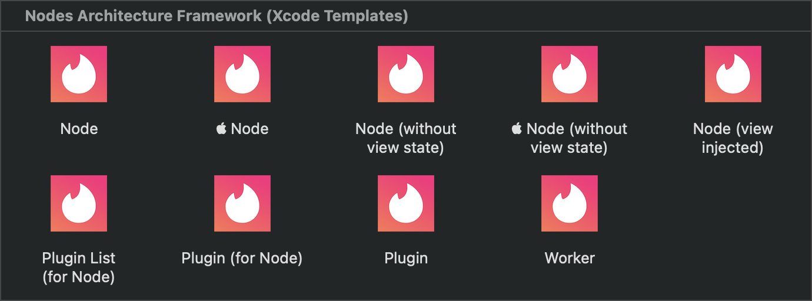

<div align="center">

[](https://github.com/TinderApp/Nodes/actions/workflows/lint.yml)
&nbsp;
[](https://github.com/TinderApp/Nodes/actions/workflows/swift.yml)
&nbsp;
[](https://github.com/TinderApp/Nodes/actions/workflows/xcode.yml)
&nbsp;
[](https://github.com/TinderApp/Nodes/actions/workflows/bazel.yml)
&nbsp;
[](https://github.com/TinderApp/Nodes/actions/workflows/docc.yml)
&nbsp;
[](https://github.com/TinderApp/Nodes/actions/workflows/genesis.yml)

[](https://github.com/TinderApp/Nodes/actions/workflows/pages.yml)
&nbsp;
[](https://github.com/TinderApp/Nodes/actions/workflows/artifactory.yml)


</div>

# Nodes Architecture Framework

Native Mobile Application Engineering at Scale

## Overview

At Tinder, we create mobile applications ***to power and inspire real connections by making meeting easy and fun for every new generation of singles***. And to do that successfully, we assembled a large team of mobile engineers who continually deliver numerous concurrent projects to empower, delight and protect our countless members around the globe.

We think [Swift](https://developer.apple.com/swift) and related technologies including [SwiftUI](https://developer.apple.com/xcode/swiftui) and [Swift Concurrency](https://developer.apple.com/documentation/swift/swift_standard_library/concurrency) are simply awesome. Yet, creating mobile applications at Tinder's scale requires a scalable application architecture as well. We designed the Nodes Architecture Framework to specifically address how to build a complex app, with a large team, involving many simultaneous initiatives.

Nodes provides a modular and plugin-based approach to assembling an app with countless screens and features. Nodes leverages reactive data streams for state management to allow app state to be distributed, which is essential when many different teams own different parts of the codebase. However, Nodes is not opinionated about which reactive library to use, or even which UI framework to use, since it is compatible with [SwiftUI](https://developer.apple.com/documentation/swiftui), [UIKit](https://developer.apple.com/documentation/uikit) and [AppKit](https://developer.apple.com/documentation/appkit).

The Nodes Architecture Framework has been developed entirely from the ground up to provide unique benefits purpose-built for Tinder. And while it was inspired by concepts and patterns in [Uber's cross-platform mobile architecture framework](https://github.com/uber/RIBs) (RIBs), no source code has been copied from RIBs into this project. Note that other open source projects such as [Needle](https://github.com/uber/needle) and [Mockolo](https://github.com/uber/mockolo) are utilized as dependencies when creating an app with Nodes.

## Design Goals

#### Reliable Extensibility

An app at scale has to remain as close to 100% reliable as possible while it is mutated and extended, in other words, as new features are added and tested. Due to its design, the Nodes architecture allows every feature to achieve very high test coverage and enables all screens of an application to be fully decoupled from one another. Any feature, any screen, any business rule and any underlying service may be dynamically swapped out for an alternate implementation. This extensibility allows new features and bug fixes to be delivered safely to avoid breaking existing functionality.

#### Feature Implementation Consistency

The Nodes architecture is backed by the Nodes framework which includes base classes and companion types to provide a cookie cutter approach to feature development. Every screen of an application is then implemented with the same exact structure. This consistent repeatable pattern is fostered by Nodes' Xcode templates.

#### Memory Management

Native mobile applications need to be good citizens within their host device and operating system. Memory leaks and even normal memory use must be managed carefully. This can be challenging enough in a small app, and inside a large codebase it can quickly become unmanageable without a clear plan. The Nodes architecture provides controls for the lifecycle of each feature screen in the application which allows all memory of each experience to be reclaimed.

## Introduction

In a Nodes based application, the code implementation for a single screen is referred to as a "node". The application can be thought of as a node tree, where navigating from screen to screen creates the branches, referred to as attaching a node to another node.

Each node is comprised of a few pre-defined types working in conjunction to power the screen and provide clean separation of concerns. Interaction handling and business logic for a screen is contained in the `Context` of the node, while its `Flow` is used for routing to other screens by attaching to other nodes within the application. The view of each node then remains solely focused on presentation. Each node can contain state which is transformed into view state and provided to the view for display.

### Xcode Templates

Nodes' Xcode templates are required to ensure correct use of the Nodes framework and to guarantee that every created node is properly defined.

Installation of the templates is performed by the Xcode templates generator (the `nodes-xcode-templates-gen` executable in the Swift package). Without customizing the generator, Xcode templates for UIKit and SwiftUI (for iOS) are installed by default. The generator supports [optional customization](#optional-customization) if needed.

#### Xcode Templates Installation

> TIP: After completing the [Quick Start](#quick-start) setup (below), Nodes' Xcode templates will be ***installed automatically***, so these instructions to manually install the Xcode templates ***may be skipped*** and are included here simply as a reference.

<details>

<summary>Manual Installation</summary>

<br>

To install Nodes' Xcode templates manually, first add Nodes as a dependency to a `Package.swift` file.

> Replace `<version>` in the command with the latest Nodes version.

```
.package(url: "git@github.com:TinderApp/Nodes.git", from: "<version>")
```

Then run the following shell command:

```
swift run -- nodes-xcode-templates-gen --id "Xcode Templates"
```

The Xcode templates will be installed to the following location to be made available within Xcode's new file dialog.

`~/Library/Developer/Xcode/Templates/File Templates/Nodes Architecture Framework (Xcode Templates)`

</details>

## Documentation

Documentation is available online at: [https://TinderApp.github.io/Nodes](https://TinderApp.github.io/Nodes)

> TIP: After completing the [Quick Start](#quick-start) setup (below), documentation is viewable in Xcode by selecting `Build Documentation` from the `Product` menu.

## Quick Start

Following these steps will create a new iOS Xcode project set up with Nodes, Needle and Mockolo.

### Requirements

- Xcode version `13.3` or greater

### Install Dependencies

```
brew install mint xcodegen needle mockolo
mint install yonaskolb/genesis
```

### Clone Nodes Repository

This step may be skipped if the Nodes repository was previously cloned.

> Replace `<version>` in the command with the latest Nodes version.

```
git clone -b <version> git@github.com:TinderApp/Nodes.git
```

### Create Project Directory

**IMPORTANT:** Do not create the new project within the cloned Nodes repository.

> Replace `<path>` in the command with the path to where the new iOS Xcode project will reside.

```
mkdir -p <path> && cd "$_"
```

### Generate Project Files

> Replace `<path>` in the command with the path to the cloned Nodes repository.

```
mint run genesis generate <path>/genesis.yml --options "author:$(git config user.name), date:$(date +"%-m/%-d/%y")"
```

When prompted, enter the latest Nodes version, a name for the new iOS Xcode project and an organization identifier (which is the bundle ID prefix such as `com.tinder`).

**OPTIONAL:** The cloned Nodes repository is no longer needed at this point and may be removed if there is no plan to create additional projects.

### Generate Xcode Project

```
xcodegen
```

Execute the `xcodegen` command any time the `project.yml` file is changed or project files are added or removed. See the [xcodegen](https://github.com/yonaskolb/XcodeGen) documentation for more information.

### Use Xcode Templates

Xcode templates for Nodes will be installed automatically to:

`~/Library/Developer/Xcode/Templates/File Templates/Nodes Architecture Framework (Xcode Templates)`

To add additional Nodes to the project, scroll to the Nodes templates in the new file dialog.



### Known Issues

Only if on a Mac computer with Apple silicon, create the following symbolic links to provision these two dependencies within a `$PATH` that Xcode utilizes:

```
ln -s /opt/homebrew/bin/needle /usr/local/bin/needle
ln -s /opt/homebrew/bin/mockolo /usr/local/bin/mockolo
```

Only if issues are encountered when executing Mockolo, build from source:

```
brew reinstall --build-from-source mockolo
```

## Optional Customization

### UI Frameworks

While Nodes works out-of-the-box with [UIKit](https://developer.apple.com/documentation/uikit) and [SwiftUI](https://developer.apple.com/xcode/swiftui) (for iOS), custom [configuration is required](Customization/Configuration.md) to use other UI frameworks, such as [AppKit](https://developer.apple.com/documentation/appkit).

### Reactive Frameworks

While Nodes works out-of-the-box with [Combine](https://developer.apple.com/documentation/combine), custom [configuration and setup is required](Customization/RxSwift.md) to use other reactive frameworks, such [RxSwift](https://github.com/ReactiveX/RxSwift).
